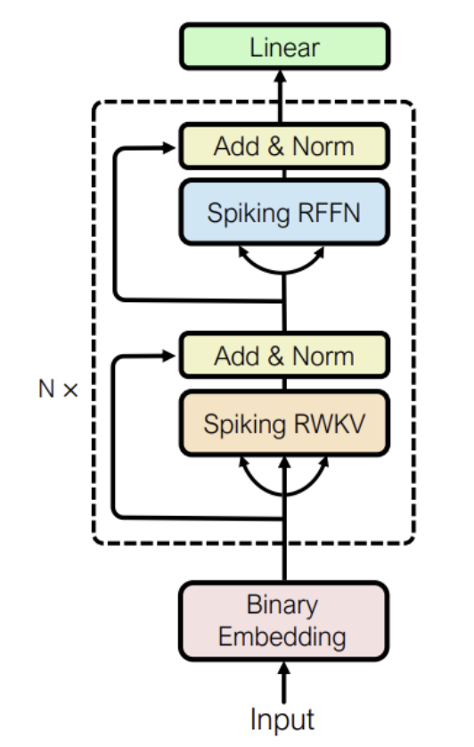

# SpikeGPT Reimplementation

Reimplementation of **SpikeGPT: Generative Pre-trained Language Model with Spiking Neural Networks** for the Cornell CS 4782 final project. This repo asks whether spiking language models can preserve useful NLP performance while reducing the energy cost of standard transformer computation.

## Introduction

SpikeGPT replaces dense self-attention-heavy transformer computation with spiking, recurrent, event-driven updates built around Leaky Integrate-and-Fire neurons. The goal is lower-power language modeling without giving up too much performance.

## Chosen Result

We reimplemented the paper's **46M-parameter SpikeGPT model**, pretrained it on **Enwik8**, and evaluated it on both **NLG** and **NLU** tasks. Our target result was the paper's central tradeoff: competitive language performance with much lower projected energy use.


*Figure 1. Accuracy comparison on NLU benchmarks, showing that our reimplementation tracks the paper closely on most tasks while trailing more noticeably on MR.*

## GitHub Contents

- [`code/`](./code): model, training, generation, fine-tuning, and analysis scripts
- [`data/`](./data): dataset notes and prepared splits
- [`results/`](./results): checkpoints, tables, and experiment outputs
- [`colab_train.ipynb`](./colab_train.ipynb): Google Colab training workflow

## Re-implementation Details

We implemented SpikeGPT in **PyTorch** and **SpikingJelly** using **binary embeddings**, **12 spiking blocks**, **SpikingRWKV**, **spiking RFFN**, and **LIF neurons**. We matched the paper's 46M setup (`n_embd = 512`, `n_layer = 12`) and also tested a learnable `beta` extension.



*Figure 2. SpikeGPT transformer architecture used in our reimplementation, with binary embeddings, stacked spiking blocks, SpikingRWKV, and spiking feed-forward layers.*

Pretraining uses **Enwik8** with next-byte prediction, and downstream evaluation uses **SST-2**, **SST-5**, **MR**, and **Subj**. Training uses Adam, cosine decay, and gradient clipping.

## Reproduction Steps

Local setup:

```bash
pip install -r requirements.txt
python code/train.py
python code/train.py --resume latest
```

Colab setup: open [`colab_train.ipynb`](./colab_train.ipynb) with a **GPU** runtime. The notebook mounts Google Drive, prepares `enwik8`, and runs either standard training or the learnable-`beta` variant from saved checkpoints.

## Results/Insights

Our results broadly matched the paper on several NLU tasks while underperforming on NLG, especially in **BPC**. The main reproduced insight still held: SpikeGPT appears meaningfully less accurate than dense GPT-style models, but far more energy-efficient.


*Figure 3. Bits-per-character comparison for natural language generation, where our model underperformed the paper but still remained competitive with simpler sequence baselines.*


*Figure 4. Validation loss after making `beta` learnable from epoch 25, showing the most promising improvement among our extensions to the original methodology.*

## Conclusion

SpikeGPT does not beat standard dense transformers, but it shows that language modeling with spiking networks is viable and potentially much cheaper to run. That efficiency tradeoff is what makes the architecture interesting for embedded and resource-constrained settings.

## References

```bibtex
@article{zhu2023spikegpt,
  title={SpikeGPT: Generative Pre-trained Language Model with Spiking Neural Networks},
  author={Zhu, Rui-Jie and Zhao, Qihang and Li, Guoqi and Eshraghian, Jason},
  journal={Transactions on Machine Learning Research},
  year={2023}
}
```

- Zhu, R. et al. *SpikeGPT: Generative Pre-trained Language Model with Spiking Neural Networks*. TMLR, 2023. https://arxiv.org/abs/2302.13939
- Cornell CS 4782 Deep Learning course materials

## Acknowledgements

This project was completed as the final project for Cornell CS 4782: Deep Learning (Spring 2026).

We thank the course staff and the authors of SpikeGPT for making their work publicly available.
