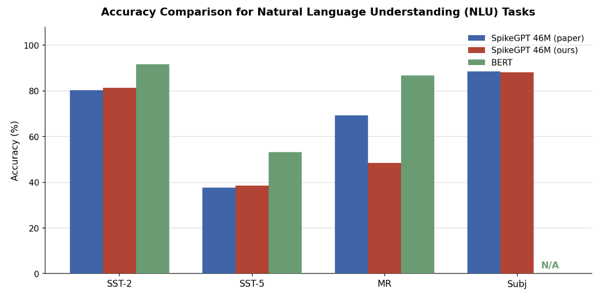
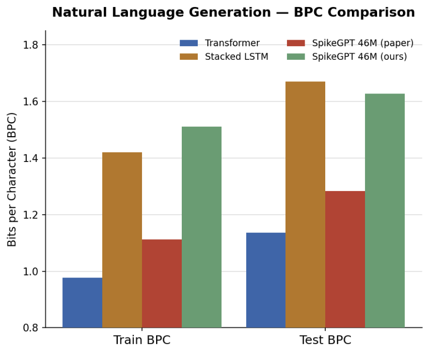
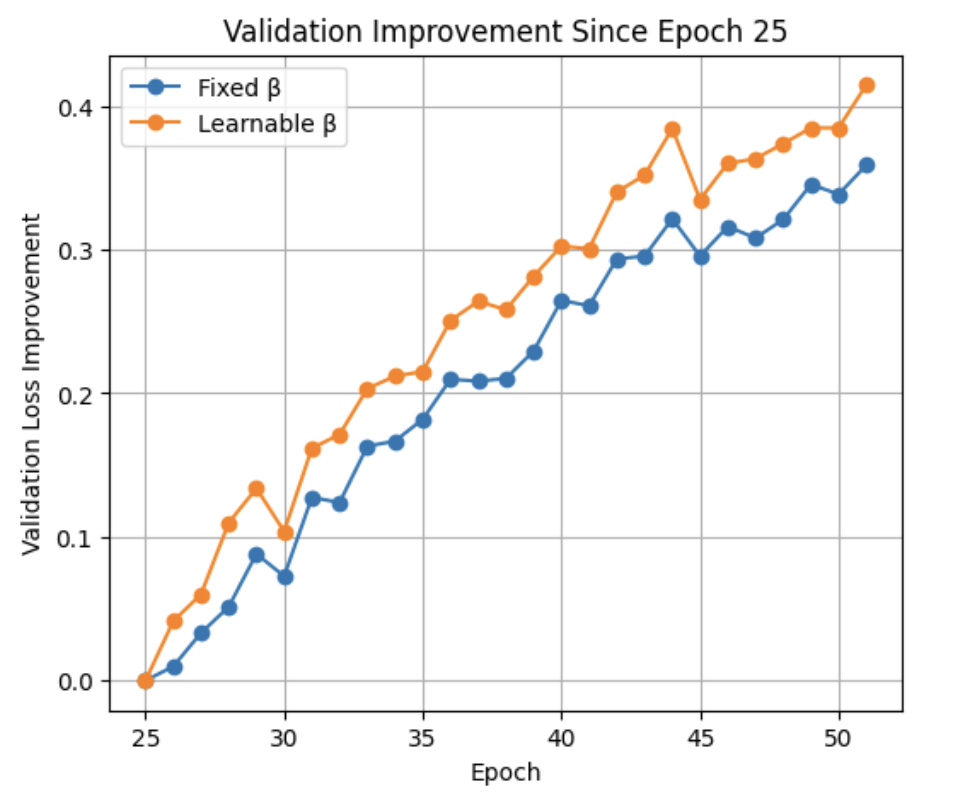

# SpikeGPT Reimplementation

Reimplementation of **SpikeGPT: Generative Pre-trained Language Model with Spiking Neural Networks** for the Cornell CS 4782 final project. This repo asks whether spiking language models can preserve useful NLP performance while reducing the energy cost of standard transformer computation.

## Introduction

This repo is our attempt to re-implement **SpikeGPT: Generative Pre-trained Language Model with Spiking Neural Networks**. The paper's main contribution is replacing dense transformer attention with spiking, recurrent, event-driven computation to make language modeling much more energy-efficient.

## Chosen Result

We reimplemented the paper's **46M-parameter SpikeGPT model**, pretrained it on **Enwik8**, and evaluated it on both **NLG** and **NLU** tasks. The result we aimed to reproduce was the paper's main tradeoff: competitive language performance with sharply lower projected energy use.



*Figure 1. NLU benchmark comparison, matching the paper's benchmark comparison setup and showing our reimplementation against the original SpikeGPT results.*

## GitHub Contents

- [`code/`](./code): model, training, generation, fine-tuning, and analysis scripts
- [`data/`](./data): dataset notes and prepared splits
- [`results/`](./results): checkpoints, tables, and experiment outputs
- [`colab_train.ipynb`](./colab_train.ipynb): Google Colab training workflow

## Re-implementation Details

We implemented SpikeGPT in **PyTorch** and **SpikingJelly** using **binary embeddings**, **12 spiking blocks**, **SpikingRWKV**, **spiking RFFN**, and **LIF neurons**. We matched the paper's 46M setup (`n_embd = 512`, `n_layer = 12`) and also tested a learnable `beta` extension.

<p align="center">
  
</p>

*Figure 2. SpikeGPT transformer architecture used in our reimplementation, with binary embeddings, stacked spiking blocks, SpikingRWKV, and spiking feed-forward layers.*

Pretraining uses **Enwik8** with next-byte prediction, and downstream evaluation uses **SST-2**, **SST-5**, **MR**, and **Subj**. Training uses Adam, cosine decay, and gradient clipping.

We evaluated NLG with **Bits per Character (BPC)** and NLU with **classification accuracy**.

## Reproduction Steps

Local setup:

```bash
pip install -r requirements.txt
python code/train.py
python code/train.py --resume latest
python code/train_learnable_beta.py
```

To reproduce our main results, install the dependencies, use the prepared `data/enwik8_split` dataset, run `python code/train.py`, and resume or branch into `python code/train_learnable_beta.py` for the extension experiments.

Use a **GPU** to reproduce the 46M model results; local CPU use is mainly practical for inspection or smaller experiments. For Colab, open [`colab_train.ipynb`](./colab_train.ipynb) with a **GPU** runtime: it mounts Google Drive, prepares `enwik8`, and runs either standard training or the learnable-`beta` variant from checkpoints.

## Results/Insights

Our results broadly matched the paper on several NLU tasks while underperforming on NLG, especially in **BPC**. Compared with the paper, the key takeaway still held: SpikeGPT trades some accuracy for major efficiency gains, including our estimated **36.2x** lower energy use than a standard GPT baseline.

<p align="center">
  
  
</p>

*Figure 3. Left: bits-per-character comparison for natural language generation, where our model underperformed the paper but remained competitive with simpler sequence baselines. Right: validation loss after making `beta` learnable from epoch 25, showing the most promising improvement among our extensions.*

## Conclusion

SpikeGPT does not beat standard dense transformers, but it shows that language modeling with spiking networks is viable and potentially much cheaper to run. That efficiency tradeoff is what makes the architecture interesting for embedded and resource-constrained settings.

## References

```bibtex
@article{zhu2023spikegpt,
  title={SpikeGPT: Generative Pre-trained Language Model with Spiking Neural Networks},
  author={Zhu, Rui-Jie and Zhao, Qihang and Li, Guoqi and Eshraghian, Jason},
  journal={Transactions on Machine Learning Research},
  year={2023}
}
```

- Zhu, R. et al. *SpikeGPT: Generative Pre-trained Language Model with Spiking Neural Networks*. TMLR, 2023. https://arxiv.org/abs/2302.13939
- Cornell CS 4782 Deep Learning course materials

## Acknowledgements

This project was completed as the final project for Cornell CS 4782: Deep Learning (Spring 2026).

We thank the course staff and the authors of SpikeGPT for making their work publicly available.
